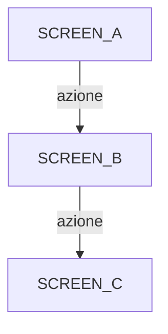

# `/emmet map` — Functional Map

## Purpose

Analizza il 100% della codebase e produce una mappa funzionale completa: schermate, azioni utente, transizioni di stato, personas, use cases e workflow diagrams.

**Output:** `.emmet/functional-map.md`

---

## Trigger

```
/emmet map
/emmet map --update
```

- Senza flag: genera la map da zero
- `--update`: rigenera la map (da usare dopo nuove feature o refactoring)

---

## Workflow

### Step 1: Detect Project Structure

```
1. Identifica stack (HTML/JS/TS/React/Vue/Svelte/etc.)
2. Trova entry point(s) (index.html, App.tsx, main.ts, etc.)
3. Determina pattern di routing (file-based, SPA hash, framework router)
```

### Step 2: Scan Screens/Views

Cerca in HTML/JSX/template files:

| Pattern | Cosa indica |
|---------|-------------|
| `id="..."` su container principali | Screen/view |
| `data-screen`, `data-view`, `data-page` | Screen esplicito |
| Route definitions (`path: "/..."`) | View con routing |
| `.screen`, `.page`, `.view` CSS classes | Screen per convenzione |
| Componenti top-level in router | View in SPA |
| File in `pages/`, `views/`, `screens/` dirs | View per struttura |

Per ogni screen trovato, documenta:
- Nome identificativo
- File e selettore/componente
- Se e entry point (default visible)
- Elementi interattivi (vedi Step 3)

### Step 3: Scan User Actions

Per ogni screen, cerca interazioni utente:

| Pattern | Tipo azione |
|---------|-------------|
| `addEventListener('click', ...)` | Click |
| `onclick="..."`, `@click="..."` | Click (inline) |
| `<button>`, `<a>`, `[role="button"]` | Click target |
| `<input>`, `<textarea>`, `<select>` | Input |
| `addEventListener('submit', ...)` | Form submit |
| `addEventListener('drag*', ...)` | Drag & drop |
| `addEventListener('key*', ...)` | Keyboard |
| `addEventListener('scroll', ...)` | Scroll |
| `<input type="range">`, slider components | Slider |
| Collapsible/accordion patterns | Toggle |

Per ogni azione, documenta:
- Elemento trigger (selettore + testo visibile)
- Tipo di azione (click, input, drag, etc.)
- Handler function chiamata
- Effetto (navigazione, state change, API call, UI update)

### Step 4: Scan State Transitions

Ricostruisci il grafo di navigazione:

| Pattern | Transizione |
|---------|-------------|
| `navigateTo(...)`, `router.push(...)` | Navigazione esplicita |
| `window.location`, `history.pushState` | Navigazione browser |
| `show/hide` pattern (display, visibility, class toggle) | Screen switch SPA |
| `setState`, store mutations | State change |
| CSS class toggle (`.active`, `.visible`, `.hidden`) | Visual state |
| Modal open/close | Overlay transition |

Genera diagramma Mermaid:


### Step 5: Derive Personas

Analizza i flussi trovati e genera personas basate su:

| Indicatore | Persona trait |
|------------|--------------|
| Flusso breve (2-3 step) | Utente casuale, bassa tolleranza |
| Flusso con opzioni avanzate | Utente esperto |
| Flusso con editing/customizzazione | Power user / creativo |
| Flusso con admin/settings | Amministratore |
| Flusso con export/share | Utente collaborativo |

Per ogni persona:
- Nome descrittivo
- Goal principale
- Flusso tipico (sequenza di screen)
- Touchpoints critici (dove puo bloccarsi)
- Tolleranza errori (Bassa/Media/Alta)

### Step 6: Generate Use Cases

Per ogni flusso significativo:

```markdown
### UC-NNN: [Titolo]
- **Persona:** [quale persona]
- **Precondizioni:** [stato iniziale richiesto]
- **Flusso principale:**
  1. [Step 1]
  2. [Step 2]
  ...
- **Flussi alternativi:**
  - Na. [Alternativa]
- **Ultimo test:** mai — NON TESTATO
```

Convenzione numerazione:
- UC-001 a UC-099: Flussi core
- UC-100 a UC-199: Flussi secondari
- UC-200+: Edge cases

### Step 7: Generate Workflow Diagrams

Per i flussi piu complessi, genera diagrammi:

```
Preferenza: Mermaid graph/sequenceDiagram
Fallback: ASCII art
```

Includere:
- Flusso principale con decision points
- Branching per errori/fallback
- Punti di integrazione esterna (API, DB)

### Step 8: Scan Pure Functions

Identifica tutte le funzioni esportate che contengono logica pura (non componenti UI, non route handler, non middleware).

#### 8a. Trova candidati

Cerca funzioni esportate:

| Pattern | Linguaggio |
|---------|------------|
| `export function`, `export const ... = (` | JS/TS |
| `module.exports.`, `exports.` | CommonJS |
| `def` (top-level, non in classe view/handler) | Python |
| `pub fn` (non in `impl Handler/Router`) | Rust |
| `func` (esportata, non `Handler`) | Go |

#### 8b. Escludi non-pure

Scarta funzioni che:
- Ritornano JSX/template (componenti UI)
- Hanno parametri `req`/`res`/`ctx`/`request`/`response` (route handler)
- Sono middleware (`next` parameter)
- Sono hook React/Vue (`use` prefix con state/effect)
- Sono solo re-export o alias
- Sono in file di tipo/interfaccia (`.d.ts`, type-only)
- Sono in file di test (`*.test.*`, `*.spec.*`)
- Sono in file generati (`dist/`, `build/`, `*.generated.*`)
- Sono file di configurazione pura (solo costanti senza logica)

#### 8c. Per ogni funzione, cataloga

- **name** — Nome funzione
- **file:line** — Posizione esatta
- **signature** — Parametri e tipo ritorno (inferiti se non tipizzati)
- **dependencies** — Import usati nel corpo, divisi in:
  - *Interne:* funzioni dello stesso progetto
  - *Esterne:* librerie/moduli esterni (queste vanno mockate nei test)
  - *Side-effect:* filesystem, network, DB, env, time, random
- **complexity** — Bassa (lineare, no branching) / Media (if/else, switch) / Alta (loop nested, ricorsione, multiple branches)
- **pure** — Si (nessun side effect) / Quasi-pura (side effect mockabile) / No (esclusa dal catalogo)

#### 8d. Classifica per priorita test

| Priorita | Criteri | Esempi |
|----------|---------|--------|
| **P1 (High)** | Logica condizionale complessa, calcoli, validazione, parsing | `validateEmail()`, `calculateTotal()`, `parseCSV()` |
| **P2 (Medium)** | Trasformazione dati, formatting, mapping | `formatDate()`, `mapUserToDTO()`, `slugify()` |
| **P3 (Low)** | Wrapper semplici, utility minimali | `getFullName()`, `isEven()`, `capitalize()` |

#### 8e. Deriva edge case per funzione

Dalla firma e dal corpo della funzione, genera edge case usando la tabella in `testing/unit.md` (sezione "Edge Case per Tipo").

#### 8f. Output

Popola la sezione `## Pure Functions` nel template con le funzioni trovate, divise per priorita (P1/P2/P3).

Stato iniziale per tutte: `Ultimo test: mai — NON TESTATO`

### Step 9: Assemble Map

Usa il template in `templates/functional-map.md` per assemblare il documento finale.

Salva in: `.emmet/functional-map.md`

---

## Regole

1. **Scan completo** — Non fermarsi ai file "principali". Scansionare TUTTI i file del progetto (escludendo node_modules, .git, build artifacts).
2. **Evidenza nel codice** — Ogni elemento nella map deve avere un riferimento `file:line` verificabile.
3. **Non inventare** — Se un flusso non e chiaro dal codice, segnalarlo come `[DA VERIFICARE]` piuttosto che indovinare.
4. **Stato test iniziale** — Alla prima generazione, tutti gli use case e le pure functions hanno `Ultimo test: mai — NON TESTATO`.
5. **Mermaid valido** — I diagrammi Mermaid devono essere sintatticamente corretti.
6. **Aggiornamento incrementale** — Con `--update`, mantenere lo stato test esistente per use case e pure functions non modificati. Solo i nuovi hanno stato `NON TESTATO`.
7. **Pure functions complete** — Scansionare TUTTI i file per funzioni esportate. Non fermarsi a `src/` — controllare anche `lib/`, `utils/`, `helpers/`, `services/`, e qualsiasi altra directory con logica.

---

## Post-Map Convenzione

Dopo aver generato/aggiornato la map, informare l'utente:

> Map funzionale generata in `.emmet/functional-map.md`.
> Trovate N schermate, N use cases, N personas, N pure functions.
> Use cases non testati: N
> Pure functions non testate: N
>
> Per eseguire il ciclo QA completo: `/emmet test`
> Per solo analisi statica: `/emmet test --static`
> Per test funzionali: `/emmet test --functions`
> Per test esperienziale UX: `/emmet test --personas`
> Per solo unit test: `/emmet test --unit`
